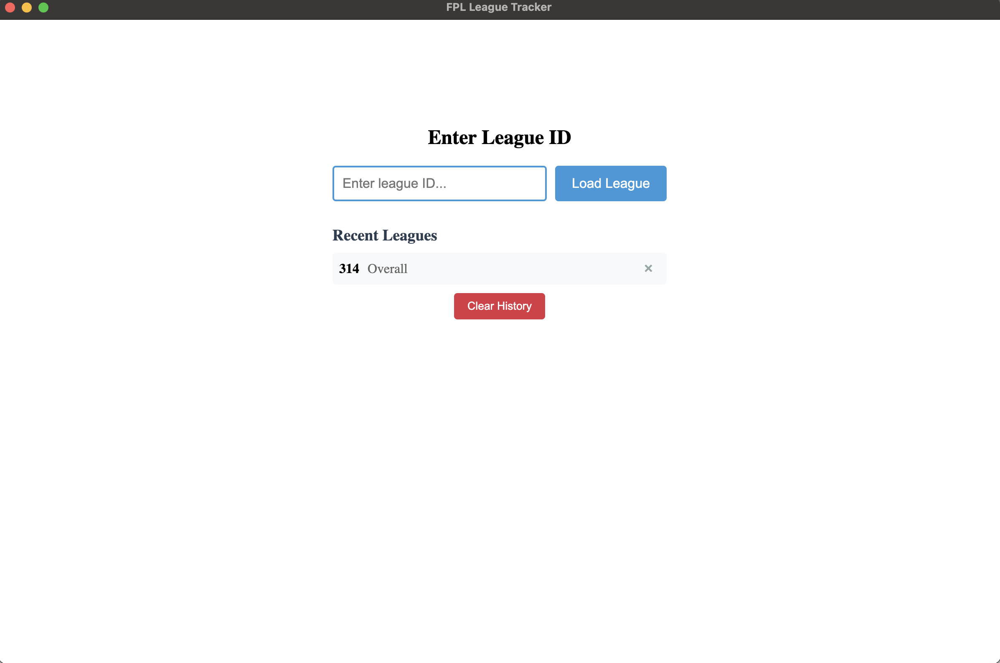
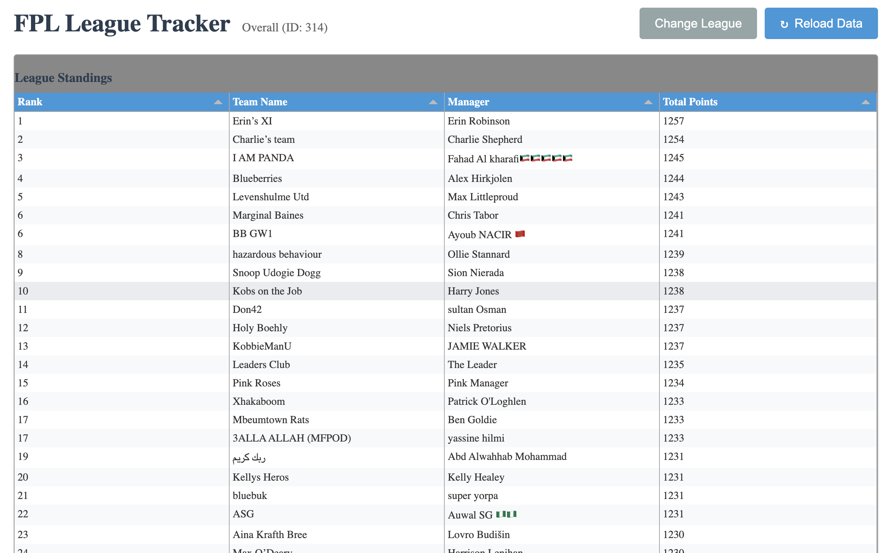
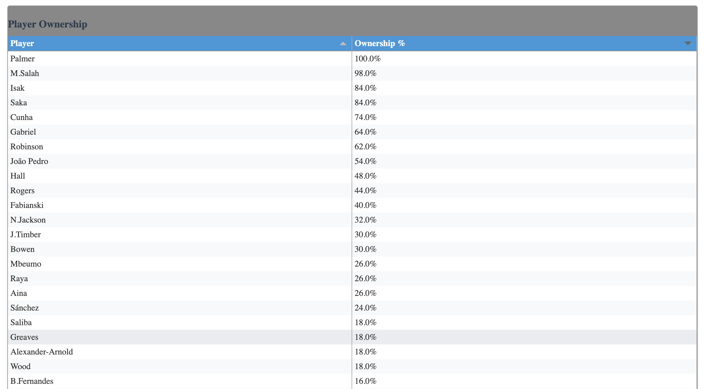
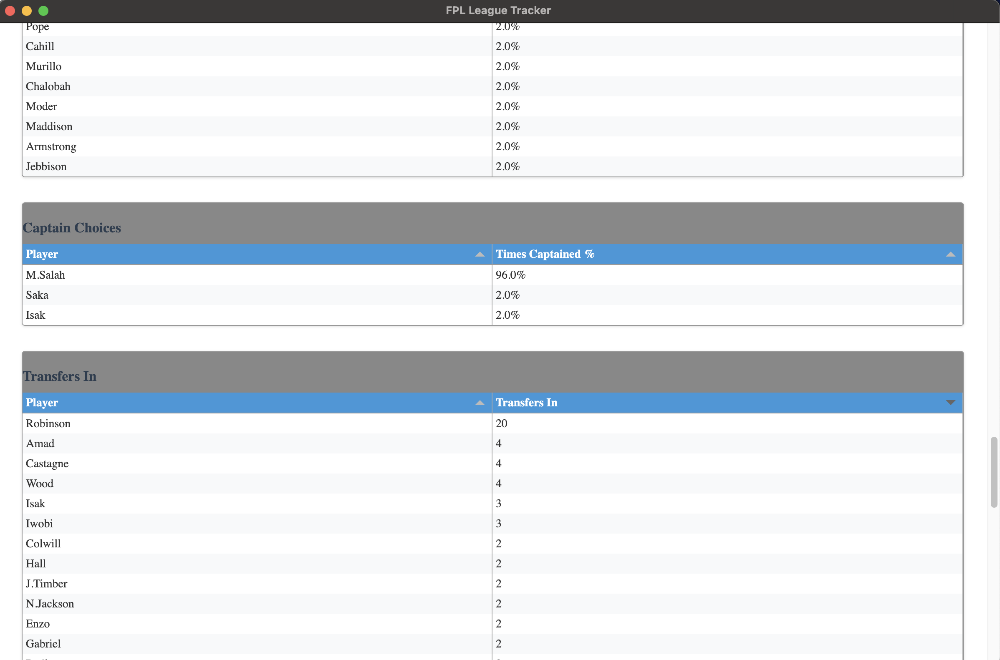
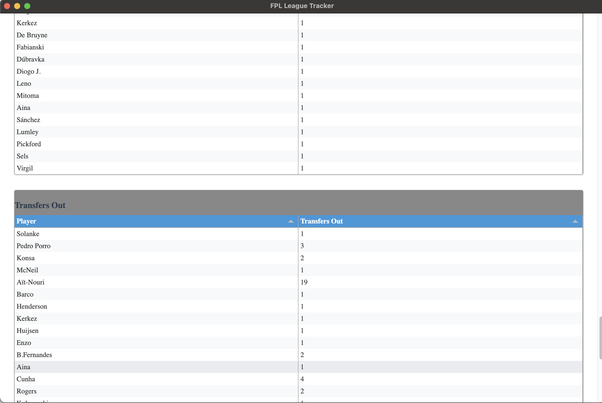
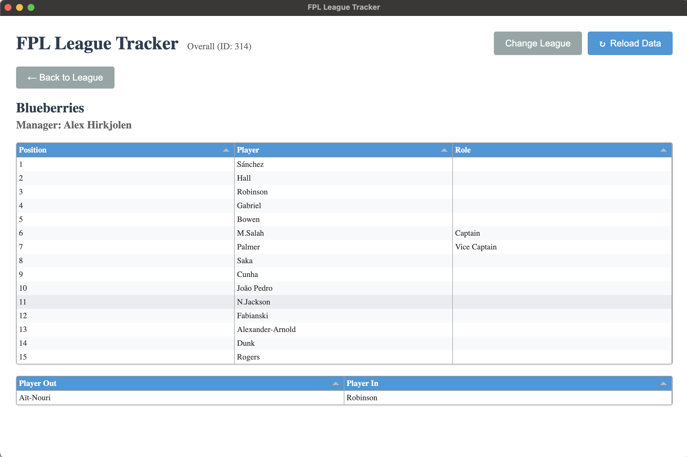

# fpl_league_stats
Getting league stats for Fantasy premier league
# FPL League Stats Tracker

A desktop application built with Electron to track and analyze Fantasy Premier League (FPL) league statistics.

## Features

- View league standings and rankings
- Track player ownership across teams
- Monitor captain choices
- Analyze transfer activity (ins and outs)
- Real-time data updates

## Screenshots







## Prerequisites

### Installing Node.js and npm

#### Windows
1. Download the Node.js installer from [nodejs.org](https://nodejs.org/)
2. Run the installer and follow the installation wizard
3. Verify installation by opening Command Prompt and running:
   ```
   node --version
   npm --version
   ```

#### macOS
1. Using Homebrew:
   ```
   brew install node
   ```
2. Or download the installer from [nodejs.org](https://nodejs.org/)

#### Linux (Ubuntu/Debian)
1. Update package list:
   ```
   sudo apt update
   ```
2. Install Node.js and npm:
   ```
   sudo apt install nodejs npm
   ```
3. Verify installation:
   ```
   node --version
   npm --version
   ```

## Running the Application

   ```
   npm start
   ```

The application window should open automatically. If it doesn't, check the console for any error messages.

### Troubleshooting

If you encounter any issues:

1. Make sure all prerequisites are installed correctly
2. Try deleting the `node_modules` folder and running `npm install` again
3. Verify you have the latest version of Node.js and npm
4. Check the console output for specific error messages


